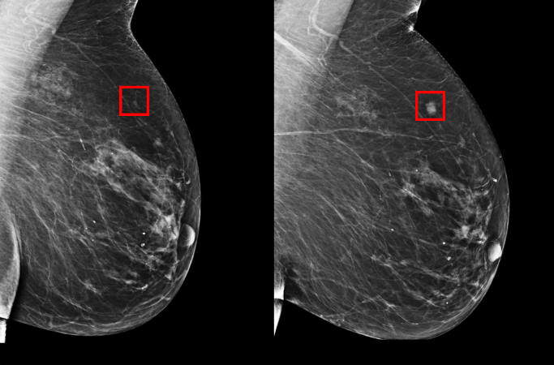

# BREAST CANCER CLASSIFICATION 🗞️

    

This repository hosts a notebook featuring an in-depth analysis of several breast cancer features  and Random Forest classification using Sklearn and Spark. The following models were meticulously evaluated:

- Sklearn Random Forest 
- Sklearn Random Forest + Feature Selection
- Spark Random Forest 
- Spark Random Forest + Feature Selection

The dataset used has been downloaded from the [Wisconsin Breast Cancer Database](https://archive.ics.uci.edu/dataset/17/breast+cancer+wisconsin+diagnostic) and contains a set of Benign and Malignant cancers.

This project has been developed as part of the **Advanced Data Science with IBM Specialization**. Feel free to ⭐ and clone this repo 😉

## 👨‍💻 **Tech Stack**

## 👨‍🔬 Exploratory Data Analysis

The first step of the project involved a comprehensive analysis of the dataset, including its columns and distribution. The idea was to identify correlations, outliers and the need to perform feature engineering. 

The dataset contains ten real-valued features  that are computed for each cell nucleus:

-  **radius** (mean of distances from center to points on the perimeter)
-  **texture** (standard deviation of gray-scale value)
-  **perimeter**
-  **area**
-  **smoothness** (local variation in radius length)
-  **compactness** (perimeter^2 / a - 1.0)
-  **concavity** (severity of concave portions of the contour)
-  **concave points** (number of concave portions contour)
-  **symmetry**
-  **fractal dimension** ("coastline approximation" - 1)

The **mean**, **standard error** and **worst** or largest (mean of the three largest values) of these features were computed for each image, resulting in 30 features and additionally the target (Diagnosis: Malignant or Benign).

### Labels Distribution

It became apparent that the labels are not well-balanced, representing malignant only 37% of the samples. This means that oversampling or undersampling might be required. The dataset initially contained:

- Number of Benign:  357
- Number of Malignant :  212

    

### Features Distribution
The feature distribution revealed a significant amount of outliers in all features except on the concave points worst feature. Also, all features are right skewed. This means that feature scaling can improve the models.

    

    

    

    

It can be seen that some features like concavity_mean are well separated, which is good for classification purposes. Others like symmetry_worst are not separated, as the distribution of Benign and Malignant is similar.

### Correlation

In general, all measurement metrics show high correlation, like perimeter, area or radius. Also, concavity, fractal dimension and concave correlate to each other. In contrary, symmetry or smoothness, do not show any correlation with any feature.

    

    

## Feature Engineering

Two approaches were selected for feature engineering:

- Scaling; Robust, Standard, MinMax
- PCA and KMeans

The scaling was performed depending on the distribution and skewness of the features. PCA and KMeans served as an intuition to see if reducing the number of features is significant.

    

Oversampling and undersampling was not selected as feature engineering as later the models showed very good results.

## 👨‍🔬 Modeling

The project involved training 4 models with varying configurations using Spark, Sklearn and feature engineering. All models showed very good performances with and without feature engineering (scaling and feature selection). The results are summarized below (confusion matrix belong to the baseline model Sklearn Random Forest):

    

- Sklearn Random Forest: 96 % and only 4 false negatives
- Sklearn Random Forest + Feature Selection: 94 % and only 6 false negatives
- Spark Random Forest: 97% and only 4 false positives
- Spark Random Forest + Feature Selection: 93% and only 9 false positives and 2 false negatives

### Model Performance Evaluation

All models demonstrated impressive performance, consistently achieving high accuracies, frequently surpassing the 90% mark and low amount of FN/FP. 
